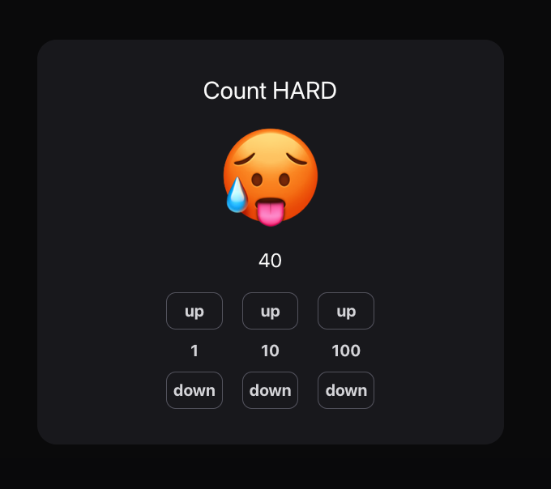

# 🚀 Assignment for Oz Bootcamp Advanced: Styling With Tailwind CSS



## ✨ Main Feature
This is an app to demonstrate
1. Styling with TailwindCSS
2. State management through Reducer

## 📦 Installation
In the project directory, you can run:
```bash
git clone https://github.com/ThePott/oz-assignment-tailwind-advanced
cd oz-assignment-tailwind-advanced
npm install
```
## ✅ Requirements
* Node.js
## 📜 License
MIT